# Whiskerwatch — GM's Manual

Whiskerwatch is a campaign companion for game masters running **Mausritter**. It replaces the
stack of notebooks and spreadsheets most GMs cobble together — warband HP, faction clocks,
hex-crawl notes, a bestiary, session recaps — with a single app that lives entirely in your
browser. No account, no server, no signup: open it and start prepping.

- 📶 **Works offline** — all data stored on-device
- 📱 **Table-ready** — phone, tablet, or laptop
- 🐭 **Rules-accurate** to Mausritter stat blocks
- 🇬🇧 🇩🇪 **English & German**

Screenshots below use the app's built-in sample campaign ("My Campaign") to show each screen
with real content.

## Contents

- [Dashboard](#dashboard)
- [Roster](#roster)
- [Adventure](#adventure)
- [Bestiary](#bestiary)
- [Factions](#factions)
- [Hex map](#hex-map)
- [Generators](#generators)
- [Live session](#live-session)
- [Sessions](#sessions)
- [Timeline](#timeline)
- [Settings & your data](#settings--your-data)
- [At the table, on a phone](#at-the-table-on-a-phone)

---

## Dashboard

*Prep mode · Overview*

Your campaign's home base. One glance tells you where the warband stands, which factions are
close to boiling over, and what needs attention before your next session.

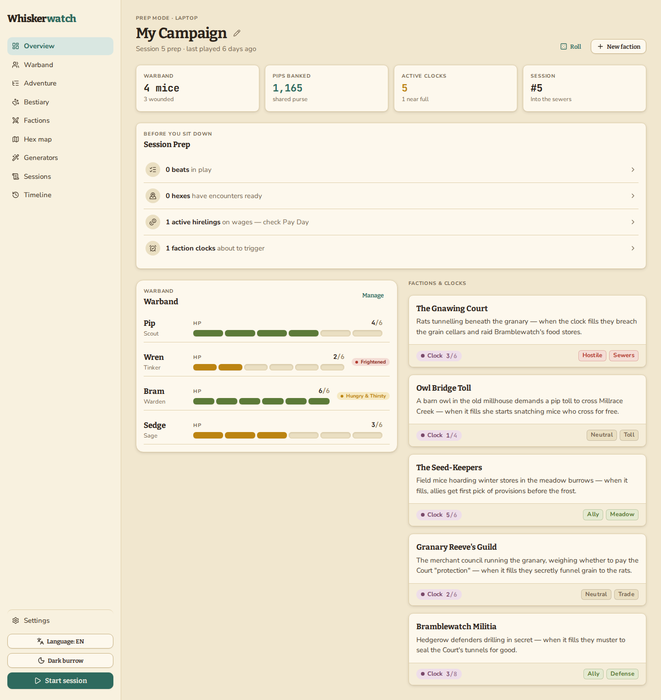

- The four stat cards (**Warband**, **Pips banked**, **Active clocks**, **Session**) update
  automatically as you play — nothing here is manually tallied.
- **Session Prep** is a checklist built from your actual data: beats in play, hexes with
  encounters ready, hirelings on wages, and clocks about to trigger. Work down this list before
  you sit down to run.
- The **Factions & Clocks** panel on the right mirrors the Factions screen so you can check clock
  progress without leaving the dashboard.
- Click **Start session** (bottom of the sidebar) any time you're ready to move into Live Session
  mode.
- Click the pencil next to the campaign name to rename it in place — handy the first time you set
  up a campaign, or whenever the adventure outgrows "My Campaign."

## Roster

*Prep mode · Warband*

Every player mouse and hireling, with HP, conditions, and scars tracked in one place — the same
data the Dashboard and Live Session screens read from.

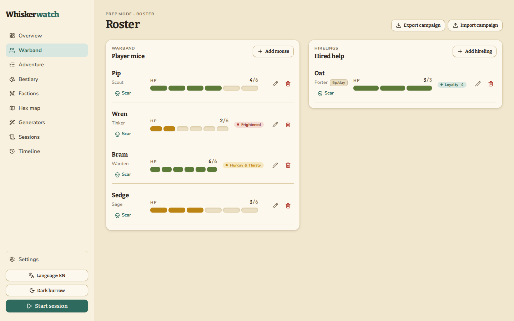

- Use **Add mouse** or **Add hireling** to bring in a new party member — a birth mouse or
  replacement after a death, or an NPC hired mid-adventure.
- Conditions like `Frightened` or `Hungry & Thirsty` and permanent **Scars** show inline, so you
  don't need to flip to a character sheet mid-scene.
- **Export campaign** / **Import campaign** (top right) save or restore your entire campaign as
  one JSON file — the same controls also live on the Settings screen.

## Adventure

*Prep mode · Adventure*

Run more than one adventure at once — a main plotline and a side job the party picked up along
the way, say — each with its own card and its own beat outline underneath it. Break each one into
beats: a lightweight outline for planning what happens next, not a rigid script.

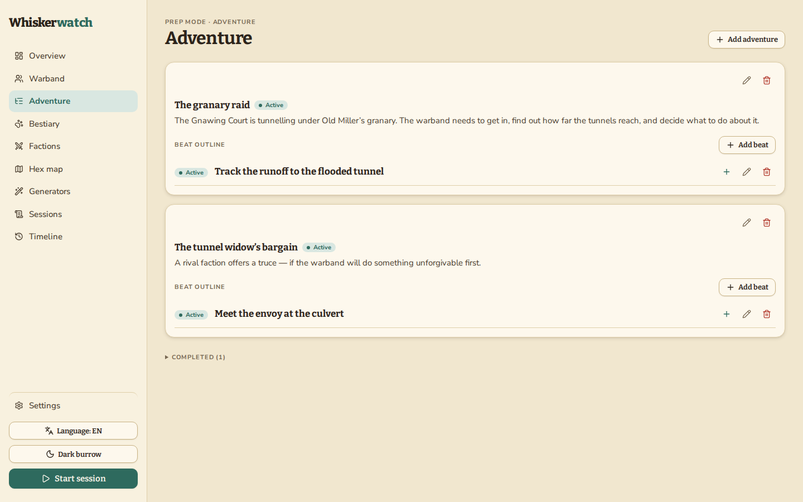

- **Add adventure** starts a new thread without disturbing the others — every adventure keeps its
  own title, description, status, and beat outline, so juggling a main plot and a side job never
  means losing track of either one's beats.
- **Add beat** builds out one adventure's outline: a beat can be a scene, a decision point, or a
  consequence you're anticipating.
- Beats you mark complete feed the **Timeline** screen automatically, so your campaign's history
  writes itself as you play.
- Once an adventure wraps up, mark it **Completed** — it drops out of the active list and into a
  collapsed **Completed (N)** section at the bottom, so wrapped-up plotlines stop competing for
  space with what's still live.
- The Dashboard's Session Prep checklist counts beats currently in play across every active
  adventure — keeping outlines current keeps that checklist honest.

## Bestiary

*Prep mode · Bestiary*

Monsters and NPCs as Mausritter-accurate stat blocks — HD, HP, Armor, attack, and a special rule
or two — ready to drop into a scene without reaching for a book.

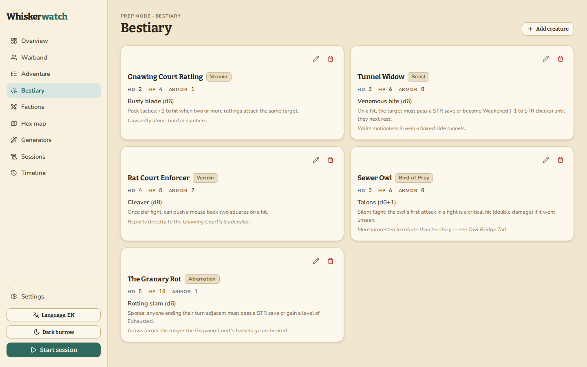

- Each card holds a full stat block plus a flavor line in italics — enough to run the creature
  cold, at the table, with no lookup.
- Tag creatures by type (`Vermin`, `Beast`, `Bird of Prey`, `Aberration`…) so the **Generators**
  screen can pull sensible random encounters.
- Click **Add creature** to homebrew a new stat block, or the pencil icon on any card to adjust
  one mid-campaign.

## Factions

*Prep mode · Factions*

Track every faction's clock, disposition, and relationships to the others — and see it all at
once in a relationship graph.

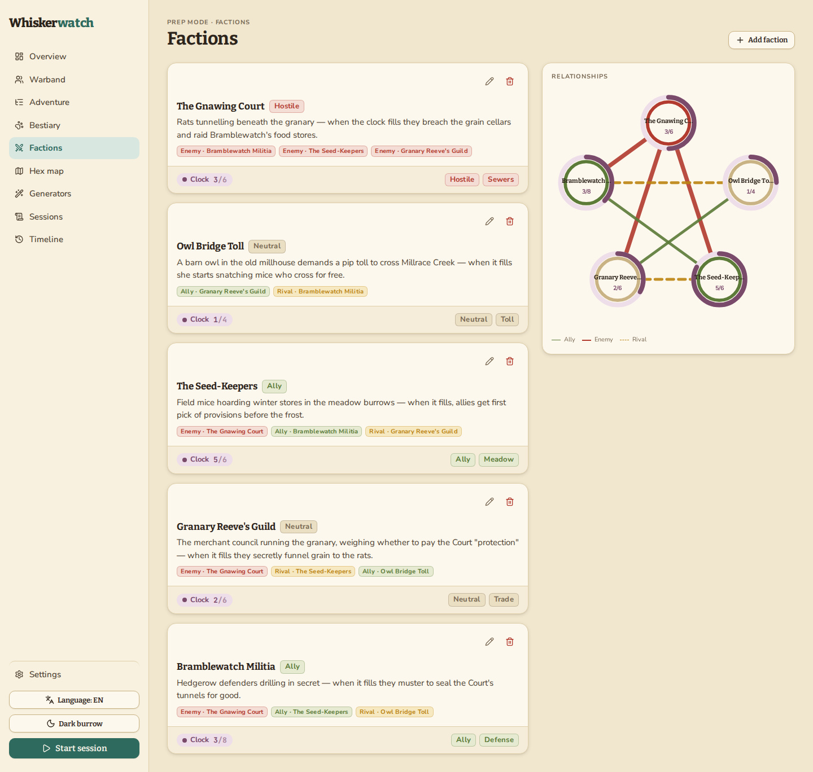

- **Clocks** — each faction card carries a clock (e.g. `3/6`) that fills as the faction's agenda
  advances — tick it up as the party's actions push events forward.
- **Relationships** — Ally, Enemy, and Rival links between factions render live in the graph on
  the right, so you can spot who's caught in the middle before the party wanders in.
- When a clock fills, the faction's description tells you exactly what happens — write your
  triggers into that text while you're prepping, not mid-session.
- **Add faction** to introduce a new player into the setting; the graph reflows automatically.

## Hex map

*Prep mode · Hex map*

A hex-crawl map with per-hex terrain and content — the same map that feeds the Generators
screen's "random encounter by hex" roll.

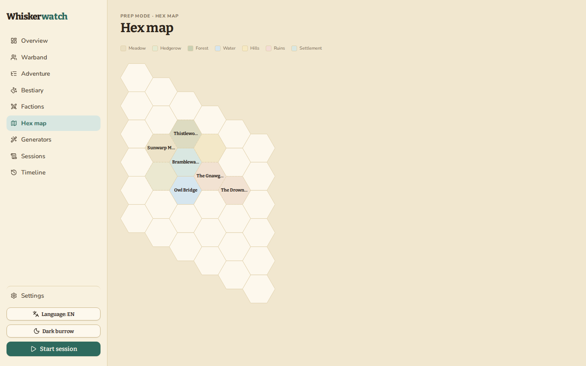

- Click any hex to open it and record terrain, points of interest, and prepped encounters.
- Use the terrain legend checkboxes at the top to filter the map down to one terrain type when
  you're prepping a specific region.
- A hex with an encounter prepped shows up in the Dashboard's Session Prep checklist as "hexes
  with encounters ready."

## Generators

*Improvise · Generators*

Four quick tools for improvising at the table: a dice roller, and random rollers for encounters,
items, and NPCs — all pulling from your own Bestiary and hex data, not generic tables.

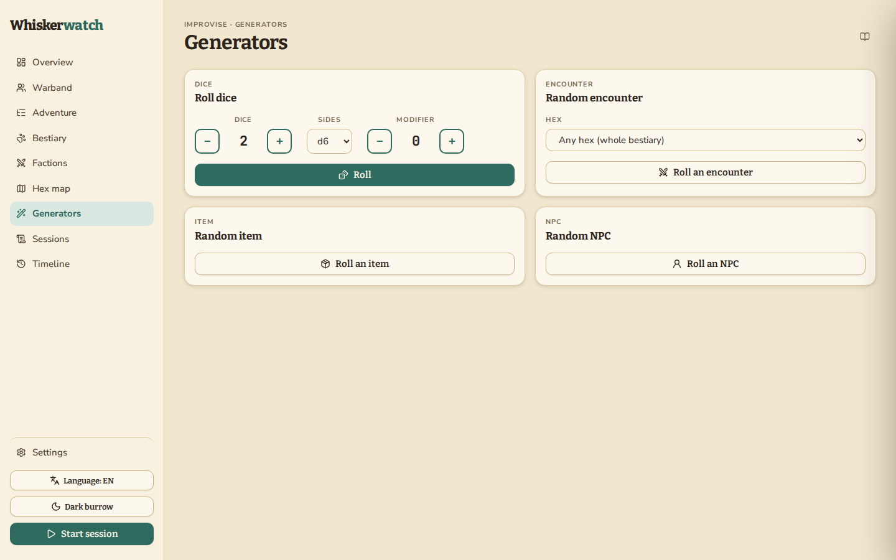

- The dice roller supports any combination of dice, sides, and modifier — set it once for a save
  (e.g. 1d20) or damage (e.g. 2d6+1) and reroll with one click.
- **Roll an encounter** can be scoped to a specific hex or left as "any hex" to pull from the
  whole bestiary — handy when the party goes somewhere you didn't fully prep.

## Live session

*Live · At the table*

The screen you run the actual game from: party HP and conditions, hireling status, faction
clocks, and a docked dice roller for ability saves — all one tap away, no scrolling to find
things.

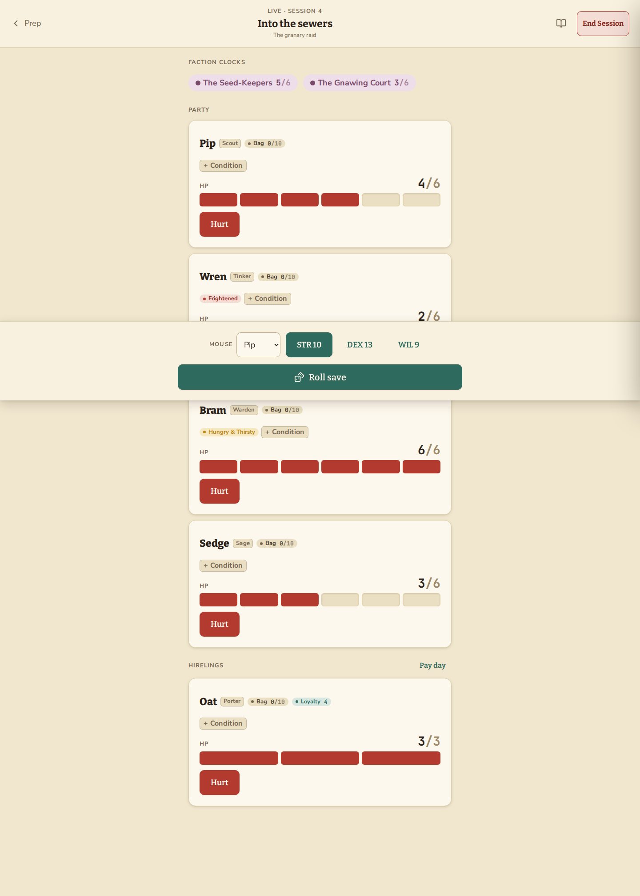

> 🎲 The docked roller at the bottom stays available while you scroll — pick a mouse, hit the
> highlighted ability score, and **Roll save**. No need to leave the HP tracker to make a check.

- Hit **Hurt** on any party or hireling card to log damage against their current HP in one tap.
- Faction clocks pinned to this adventure's active factions sit at the top, so a triggering clock
  is never a surprise.
- **End Session** (top right) closes out the session and can hand off directly into drafting a
  recap on the Sessions screen.
- Running two adventures with an active beat at the same time? A chip under the session title
  lets you pick which one is "live" for the table right now — tap it to see both adventures and
  their current beat, then choose. With zero or one active beat, nothing changes: the beat title
  just shows underneath the session name as usual.

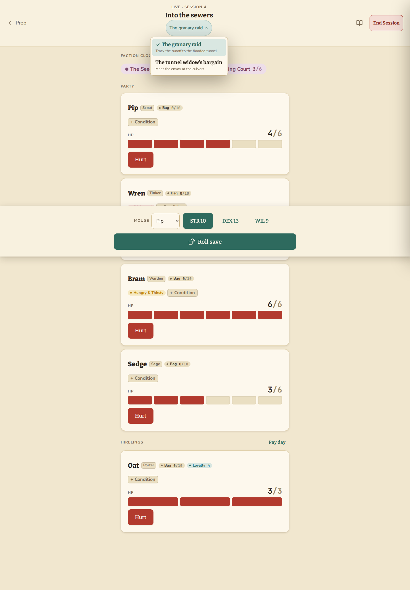

## Sessions

*Recap mode · Sessions*

A running log of what actually happened, session by session — the record you'll thank yourself
for three months into the campaign when you can't remember why a faction hates the party.

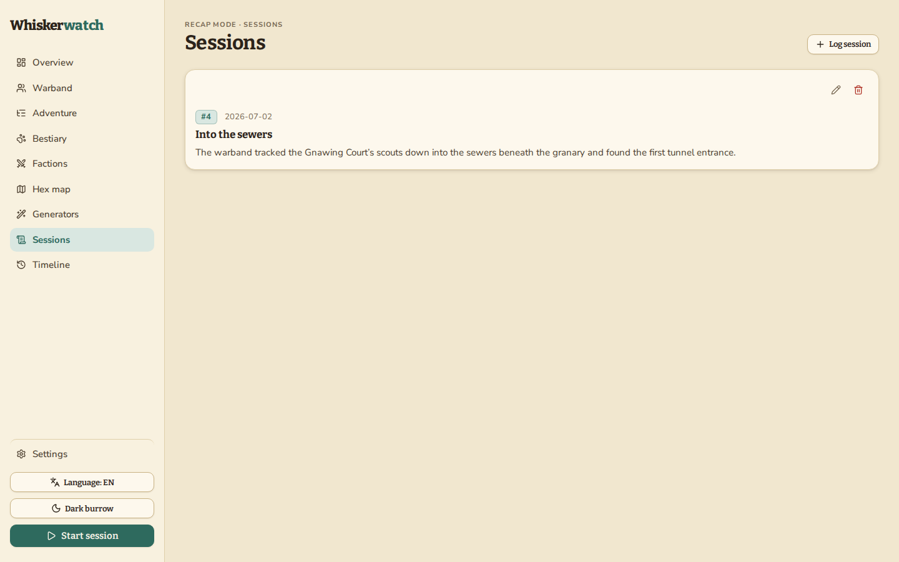

- **Log session** to write up a recap from scratch, or finish one that was drafted for you
  automatically when you ended a Live Session.
- Recaps here are what populate the **Sessions** entries on the Timeline.

## Timeline

*Prep mode · Timeline*

Your campaign's history, assembled automatically from sessions logged, beats completed, clocks
triggered, and mice lost — filterable by type.

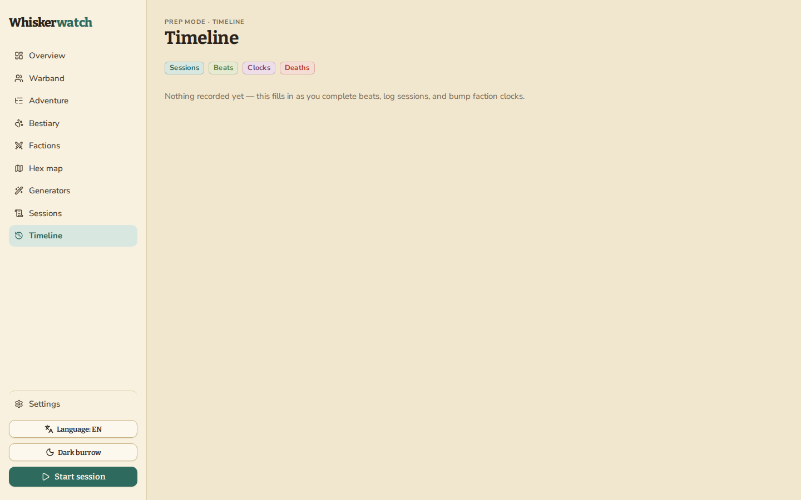

- You never write timeline entries by hand — they're derived from the Adventure, Sessions, and
  Factions screens, so the history stays accurate without extra bookkeeping.
- Use the `Sessions` / `Beats` / `Clocks` / `Deaths` chips to isolate one thread — useful when you
  need to recall exactly when a faction's clock filled.

## Settings & your data

*Prep mode · Settings*

Whiskerwatch has no account and no server — your campaign lives only in this browser. This
screen is where you back it up.

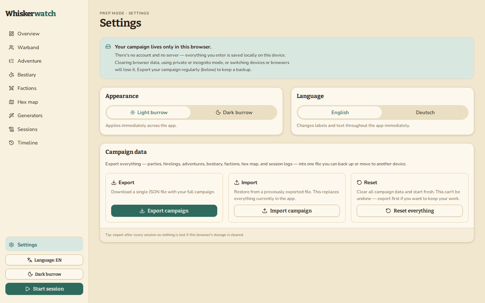

> ⚠️ Clearing your browser's site data, using a private/incognito window, or switching devices
> will lose your campaign. **Export a backup after every session.**

- **Export** downloads one JSON file with everything: parties, hirelings, adventures, bestiary,
  factions, hex map, and session logs.
- **Import** restores from that file — useful for moving to a new device or browser. It replaces
  everything currently in the app, so export first if you want to keep the current state as well.
- **Reset everything** wipes the campaign and starts fresh. This can't be undone.
- Appearance (light/dark "burrow") and language (English/Deutsch) apply immediately across the
  whole app.

## At the table, on a phone

*Responsive · At the table*

Every screen in Whiskerwatch is built to work from phone width up, since it's as likely to be
propped next to your dice as open on a laptop during prep. The sidebar collapses into a top bar
with a horizontally scrolling nav strip.

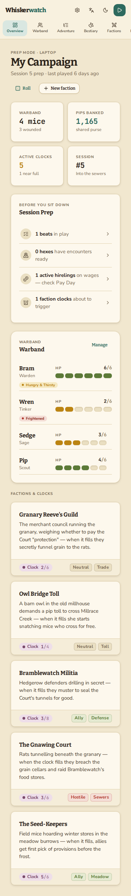

- Tap the app name's row icons (settings, language, theme, start session) directly from the
  mobile top bar — no need to hunt through a menu.
- The horizontally scrolling nav strip below the top bar holds every screen from the desktop
  sidebar, in the same order.

---

Whiskerwatch — a campaign companion for Mausritter game masters. All data stays on your device;
there's nothing to sign into and nothing to lose track of but the mice themselves.
